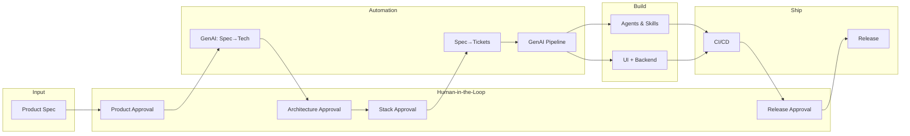

# GenAI-Native Product Blueprint — Index

This repository is the **single source of truth** for building a next-generation, GenAI-driven organization that can build **any application** (e.g. CRM, internal tools, marketplaces). Every product capability flows from spec → approval → tickets → implementation → release, with agents and automation as first-class constructs. **CRM is one possible application**; the blueprint is generic. **COGS (Cost of Goods Sold)** is a cross-cutting concern: every pillar considers cost (per feature, capability, agent, flow, pipeline run) and the COGS dashboard is mandatory ([01-technology.md](./01-technology.md)).

The **[Product Factory](./PRODUCT-FACTORY.md)** is the *software for creating software*: the tool that tracks the entire workflow from ideas → product spec → PM/leader approval → architecture review → architecture approval → software creation → CI/CD to stage → UAT (product + eng) → ship to prod. It is pipeline-based, ticket-driven, and gives senior leadership full visibility.

---

## High-Level Flow

---

## Product Factory (overarching tool)

| Doc | Purpose |
|-----|--------|
| [PRODUCT-FACTORY.md](./PRODUCT-FACTORY.md) | End-to-end pipeline: ideas → spec → approvals → architecture → build → CI/CD → UAT → prod; ticket tracking; senior leadership visibility |
| [IMPLEMENTATION.md](./IMPLEMENTATION.md) | **Building the Product Factory:** how to materialize the factory app (phasing, components, build order, where decisions live) |
| [PROCESS-AUDIT.md](./PROCESS-AUDIT.md) | **Process audit:** single outline of the flow + what's wrong or missing (order of ops, bugs/hotfixes, dependencies, rework, COGS, etc.) and suggested fixes |

---

## The Eight Pillars

| # | Pillar | Doc | Purpose |
|---|--------|-----|--------|
| 1 | **Technology** | [01-technology.md](./01-technology.md) | Core tech stack, principles, high-efficiency development |
| 2 | **Product → Technology** | [02-product-to-technology.md](./02-product-to-technology.md) | Product spec → tech capabilities via GenAI |
| 3 | **Ticket Automation** | [03-ticket-automation.md](./03-ticket-automation.md) | Spec → JIRA/Git tickets (eng, product, release, marketing, press); vendor vs built-in |
| 4 | **Human-in-the-Loop** | [04-human-in-the-loop.md](./04-human-in-the-loop.md) | Approvals: product spec, architecture, software stack, release |
| 5 | **Release & CI/CD** | [05-release-and-cicd.md](./05-release-and-cicd.md) | Coordinated releases, CI/CD as mandatory |
| 6 | **Agents & Skills** | [06-agents-and-skills.md](./06-agents-and-skills.md) | Agents and agent skills as first-class constructs |
| 7 | **Orchestration** | [07-orchestration.md](./07-orchestration.md) | Orchestrating agent skills for customer-facing features |
| 8 | **GenAI Pipeline** | [08-genai-pipeline.md](./08-genai-pipeline.md) | UI + backend from approved spec; features in minutes |

---

## How to Use This Blueprint

1. **Add details** in each pillar doc under "Details to add" or the designated sections.
2. **Keep cross-references** — when you update one pillar (e.g. approval gates), update dependent pillars (e.g. pipeline, tickets).
3. **Drive tooling from here** — ticket schemas, approval workflows, and pipeline configs should be derivable from these docs (and eventually from GenAI).
4. **Version the blueprint** — tag or branch when you lock a "generation" of the org/product (e.g. `blueprint-v1`).
5. **Keep COGS in view** — capability schema, tickets, approvals, agents, flows, and pipeline all carry or reference COGS; the COGS dashboard is the single place for cost visibility.

---

## Quick Links

- [Product Factory](./PRODUCT-FACTORY.md)
- [Technology](./01-technology.md)
- [Product → Technology](./02-product-to-technology.md)
- [Ticket Automation](./03-ticket-automation.md)
- [Human-in-the-Loop](./04-human-in-the-loop.md)
- [Release & CI/CD](./05-release-and-cicd.md)
- [Agents & Skills](./06-agents-and-skills.md)
- [Orchestration](./07-orchestration.md)
- [GenAI Pipeline](./08-genai-pipeline.md)
