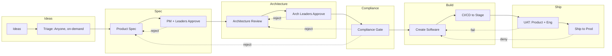

# Product Factory — Software for Creating Software

**Product Factory** is the system that tracks and orchestrates the entire workflow from idea to production. It is pipeline-based, ticket-driven, and gives senior leadership full visibility. Every item (idea, spec, architecture, build, release) moves through defined stages with clear owners and approvals.

---

## Independent of customer-facing software

**Yes.** Product Factory is **internal** — used by your organization (product, architecture, engineering, release) to *build* and ship software. It is not the application that end users use.

| | **Product Factory** | **Customer-facing application(s)** |
|---|---------------------|-------------------------------------|
| **Who uses it** | Your team (PMs, architects, engineers, leadership) | Your customers or users (end users of the app) |
| **Purpose** | Track ideas → spec → approval → architecture → build → CI/CD → UAT → prod; **customer-facing product docs** (release notes, external docs) | The actual product: e.g. CRM, internal tool, marketplace (UI, backend, agents, workflows) |
| **Output** | Pipeline visibility, tickets, approvals, shipped releases | The application(s) you build (e.g. CRM is one; others as needed) |

The **customer-facing application** (or applications) is the *output* of the Product Factory: it is what gets built, tested, and shipped to prod. Product Factory does not ship to customers; it ships whatever product you are building (CRM, tools, or other apps).

- **Separate repos** — The **customer-facing app** (e.g. CRM codebase) and the **Product Factory** (pipeline, hybrid layer, internal tooling) live in **separate repositories**. No single monorepo requirement.
- **Repos are configurable** — Which repo is “the app” vs “the factory,” and where specs/architecture/docs live, is **configured** (e.g. per product or org), not hardcoded. Configuration defines repo URLs/paths so the pipeline and lineage point at the right places.

---

## Product Factory and product configuration

**Configure once when building the factory or when defining a new product.** The “basic things” — ticketing system, codebase context, meeting notes, messaging, repos — are set **at setup time** so every capability under that product gets the same context sources. No per-capability re-setup.

**When to configure:**

- **When building the Product Factory** — Initial setup: default ticketing system(s), default messaging (e.g. Slack), meeting pipeline (if used), and any org-wide defaults (e.g. cycle time, approval tool).
- **When defining a new product** — Each product (e.g. CRM, Internal Tools, Marketplace) can have its own configuration: **ticketing system** (JIRA, GitHub, Linear — URL, auth, project/board mapping), **codebase context** (which app repo(s), how to index or summarize for GenAI so generated code fits), **repos** (where specs and architecture live, where app code lives), **other artifacts** (eeting notes — pipeline, storage, tagging rules), **messaging** (Slack vs Teams vs other — channel naming convention, e.g. `#proj-123`). Optionally: cycle time target for that product, compliance checklist.

**Codebase context is configured here.** It is **required when you define a new product** (or at factory build if you have a single product): which repo(s) are the app, how the factory (or GenAI) gets “existing code / patterns” — e.g. index repo, periodic summary, or “read these paths.” That way the build pipeline and codegen always have a **consistent view** of the codebase; you don’t configure it per capability.

**What to configure (checklist):**

| What | Purpose |
|------|---------|
| **Ticketing system** | JIRA, GitHub, Linear, or mix — URL, auth, project/board mapping so tickets and approval state are read/written correctly. |
| **Repos** | App repo(s), specs/arch repo (or paths) — so pipeline and lineage point at the right Git locations. |
| **Codebase context** | How to supply “existing code / patterns” to GenAI (e.g. which repo(s), index or summarize, which paths). Required when defining a new product. |
| **Meeting notes / recordings** | Pipeline (transcribe → summarize → tag), storage (Git or meeting store), platform (Zoom, Meet, Teams). Optional but configure once if used. |
| **Messaging** | Slack vs Teams vs other; channel naming convention (e.g. `#proj-123`) so capability ID maps to channel. |
| **Cycle time** | Max days (e.g. 7), ideal (e.g. 24h) — per product or org. |
| **Compliance / legal** | Checklist or gate config if used. |

**Will this help?** **Yes.** One place to configure means (1) **consistent context** for all capabilities under a product, (2) **no repeated setup** per capability, (3) **clear ownership** — “this product uses JIRA + Slack + this app repo,” (4) **codebase context** is always available for the build pipeline and GenAI when you define a product. New products get their own config; existing products run with the config you set when they were defined.

---

## Vision

- **One pipeline** — Ideas → Product spec → Approval → Architecture → Approval → **Compliance** → Software → CI/CD → Stage → UAT → Prod.
- **All tracked by tickets** — Each stage creates or updates tickets (JIRA/Git or equivalent); traceability is end-to-end.
- **Speed** — One idea (capability) shipped in **under 7 days** from ideation to delivery (must not exceed). **Ideal: 24 hours.** Targets are **configurable** (e.g. per product or org). Per-stage SLAs should support the chosen target.
- **Visibility for senior leadership** — Dashboards and reports show pipeline health, bottlenecks, COGS, and approval status so leadership can see what’s in flight and where to intervene. **Automated project status** is sent to leadership and is **derived from online data** (tickets, docs); all artifacts are kept up to date and available for review and reporting.

---

## Idea triage (idea → feature/capability)

- **Ideas are not yet pipeline items** — An idea (e.g. “Lead scoring”) can be one capability or many (“Data pipeline,” “Scoring model,” “UI for scores”). Before the main pipeline starts, ideas must be **triaged** into one or more features/capabilities.
- **Owner** — **Anyone** can run **idea triage / scope-to-features** (not restricted to product or PM). Input: idea (from anyone). Output: one or more **capability IDs** (project + number) that enter the pipeline. Triage is **on-demand** (when an idea is submitted or when someone triages), not on a fixed schedule. Each output capability becomes a single pipeline item with its own lifecycle.
- **Rule** — Nothing enters the “Product spec” stage without a capability ID from triage. So: Idea → Triage (product) → one or more capability IDs → each goes through the pipeline.

---

## Feature and capability tracking

- **Every feature is tracked** — Each feature or capability has a **single pipeline item** in Product Factory. Nothing is built or shipped without a corresponding tracked feature/capability. One feature = one pipeline lifecycle (triage → spec → approval → architecture → approval → **compliance** → build → CI/CD → UAT → prod).
- **One feature, one reference** — A feature or capability uses a **project + number** ID (e.g. `PROJ-123`). It can be **referenced everywhere**: in tickets (e.g. GitHub issue number or label), doc paths (e.g. `product-specs/PROJ-123.md`), and collaboration (Slack). Lineage and reporting stay consistent by this ID.
- **Active = visible** — Any feature or capability that is in flight (not yet shipped or cancelled) is **active**. For senior leadership, reporting on **every active capability** must be **clearly present** (see [Senior leadership visibility](#senior-leadership-visibility)).
- **Dependency model** — A capability can **depend on** one or more other capabilities (e.g. “Lead scoring UI” depends on “Lead scoring API”). **Gate:** B cannot start **Build** until A is shipped or the dependency is **waived** (earlier stages — spec, architecture — are not blocked). **Waiver:** Product lead or tech lead can waive; waiver is recorded on the ticket. **Dashboard:** Each capability card shows **Blocked by** (e.g. PROJ-xxx) and **Blocking** (e.g. PROJ-yyy) so leadership sees why something is waiting.

---

## Pipeline Stages (in order)

| Stage | Name | Owner / approver | Output | Pillar(s) |
|-------|------|------------------|--------|-----------|
| **0** | **Idea triage** | Anyone (on-demand) | One or more capability IDs from each idea | See [Idea triage](#idea-triage-idea--featurecapability) |
| **1** | **Ideas** | Anyone (captured) | Idea / opportunity | Input; triage turns ideas into capability IDs |
| **2** | **Product spec** | Product (created) | Product spec document | [02-product-to-technology.md](./02-product-to-technology.md) |
| **3** | **Product spec approval** | Product managers + their leaders | Approved spec | [04-human-in-the-loop.md](./04-human-in-the-loop.md) |
| **4** | **Architecture review** | Architecture leaders (created) | Architecture doc / tech design | [04-human-in-the-loop.md](./04-human-in-the-loop.md), [01-technology.md](./01-technology.md) |
| **5** | **Architecture approval** | Architecture leaders | Approved architecture | [04-human-in-the-loop.md](./04-human-in-the-loop.md) |
| **6** | **Compliance gate** | Legal / compliance (or designated reviewers) | Compliance sign-off | [04-human-in-the-loop.md](./04-human-in-the-loop.md) |
| **7** | **Software creation** | Engineering + GenAI pipeline | Code, agents, UI/backend | [08-genai-pipeline.md](./08-genai-pipeline.md), [06-agents-and-skills.md](./06-agents-and-skills.md) |
| **8** | **CI/CD to stage** | CI/CD system | Deployed to staging | [05-release-and-cicd.md](./05-release-and-cicd.md) |
| **9** | **User acceptance testing (UAT)** | Product manager + engineer (both approve via sign-off template; tracked as tickets) | UAT sign-off | [04-human-in-the-loop.md](./04-human-in-the-loop.md) (gate) |
| **10** | **Ship to prod** | Release manager / authorized deployer | Live in production | [05-release-and-cicd.md](./05-release-and-cicd.md), [04-human-in-the-loop.md](./04-human-in-the-loop.md) (release approval) |

---

## How we build the software (double-click on Build)

Stage 7 (“Software creation”) is where approved spec and architecture become running code. This section spells out the flow so it’s one place to read *how* we build.

**Trigger:** Compliance sign-off (stage 6) is in place. The capability has an approved spec (doc + version) and approved architecture (doc + version). Dependencies (if any) are shipped or waived. The **context bundle** for the capability (see [Context at every step](#3-extracting-context-at-every-step)) is available: capability ID, spec path, arch path, approved versions, tickets, Slack.

**Steps (in order):**

1. **Load context** — The build pipeline (or engineer) loads the **context bundle** for the capability: approved spec and architecture from Git (paths + versions from ticket or config). No build runs without this context so generated work matches what was approved.

2. **Spec → tech capabilities** — GenAI turns the **approved product spec** into a **technology capability description** (e.g. YAML: entities, APIs, screens, skills, COGS). This is the machine-readable target for codegen and tickets ([02-product-to-technology.md](./02-product-to-technology.md)). Architecture doc constrains how (stack, services, patterns).

3. **GenAI pipeline runs** — Using the capability YAML and architecture, the GenAI pipeline ([08-genai-pipeline.md](./08-genai-pipeline.md)) produces (or scaffolds) **UI, APIs, backend logic, tests**, and optionally **agent/skill stubs** ([06-agents-and-skills.md](./06-agents-and-skills.md)). Output targets the **configured app repo** (separate from Product Factory repo). Pipeline run **COGS** (e.g. API cost) is recorded and fed to the COGS dashboard.

4. **Code in repo + PR** — Generated (or human-written) code is committed to a **branch** (e.g. `proj-123/lead-scoring-api`). A **PR** is opened and **linked to the capability ticket** (and vice versa). PR description or bot comment carries the context bundle (capability ID, spec/arch links, Slack) so reviewers have full context.

5. **Human review** — Engineers (and/or PM) **review the PR**. Review is mandatory; no merge without approval. Discussion can happen in the PR or in the capability Slack channel. Changes are iterated on the same branch; rework is normal.

6. **Merge → CI/CD** — On merge, **CI/CD** ([05-release-and-cicd.md](./05-release-and-cicd.md)) runs: build, test, deploy to **staging**. Tickets are updated (e.g. “In staging”). The pipeline stage in Product Factory moves to **CI/CD to stage** (8), then **UAT** (9) when ready.

**Who does what:** *Engineering* owns implementation and review; *GenAI pipeline* produces the first cut (scaffolding or full implementation) from spec + arch. Both use the same context bundle. If the pipeline is fully automated, engineers still review and approve PRs; if engineers write most of the code, they use the same spec/arch/docs and the pipeline may only run tests and deploy.

**Output:** Code in the app repo, PR(s) linked to the capability ticket, CI/CD green, deploy to staging. Next: UAT (stage 9) then release (stage 10).

**Quality test cases** — Test cases are **generated from the spec and acceptance criteria** (e.g. by GenAI or from the capability YAML) so they are context-aware and traceable to the capability. Tests cover success criteria, edge cases, and UAT scenarios where applicable. Test results (pass/fail, coverage) are **published** and visible in the leadership view (see [Automatic software building factory](#automatic-software-building-factory-context-quality-tests-publish-all-online)).

---

## Do we have enough context to build? Specific inputs vs arch artifacts

**Short answer:** **Spec + architecture + capability YAML** are the **core** and usually cover “what to build” and “how to build” at the system level. For many capabilities that is **enough**. For full automation or high-fidelity codegen, **codebase context** is strongly recommended, and some teams will want **specific extra artifacts** (e.g. API contract, env/config) if the arch doc doesn’t spell them out.

**What the arch design artifacts cover:**

- **Architecture doc** (approved) — Stack, service boundaries, patterns, integrations, data model, security, scalability, and (if you require it in the template) API contracts, key flows, or error handling. When the arch doc is **detailed enough** (e.g. “API X with request/response shape,” “UI state for screen Y”), it plus the spec and capability YAML are **sufficient** for the build pipeline and GenAI to produce correct, reviewable output.
- **Capability YAML** (from spec, constrained by arch) — Machine-readable “what”: entities, APIs, screens, flows, COGS. This is the **primary input** for codegen and tickets. Arch says “how” (where it lives, which patterns); YAML says “what” (which endpoints, which fields).

**When arch is not enough — specific inputs to add:**

| Gap | What’s missing | Specific input or practice |
|-----|----------------|----------------------------|
| **Arch is high-level only** | Arch describes services and patterns but not every API shape, field, or UI state. | (a) **Tighten the arch template** so it requires enough detail for codegen (e.g. API contract section, key screens), or (b) **Derive an artifact** (e.g. OpenAPI from spec + arch via GenAI) and feed that into the pipeline as explicit input. |
| **Generated code doesn’t fit the repo** | GenAI doesn’t know existing code, conventions, or file layout. | **Codebase context** — configured when you **define the product** (or build the factory): which app repo(s), how to index/summarize for GenAI. See [Product Factory and product configuration](#product-factory-and-product-configuration). Then every capability under that product gets the same context; no per-capability setup. |
| **Environment / config / NFRs** | Env vars, feature flags, SLAs, rate limits not in arch. | Either **include in arch** (e.g. “Config / NFR” section) or add a **small, explicit artifact** (e.g. config schema or checklist) and attach to the capability; pipeline reads it as part of context. |
| **Acceptance criteria scattered** | Spec has them but they’re not machine-friendly for test generation. | Keep **acceptance criteria** in the spec (structured section) and/or in the capability YAML so test case generation has a single, clear source. |
| **Compliance / legal constraints** | May be in spec or arch; if not, build might miss them. | Ensure **compliance gate** output (or a “constraints” section in spec/arch) is part of the context bundle so the pipeline and codegen respect them. |

**Build-readiness (context sufficiency) checklist:**

- **Required to start build:** Approved **spec** (doc + version), approved **architecture** (doc + version), **capability YAML** (from spec, aligned with arch), compliance sign-off, dependencies met or waived. No build without these.
- **Recommended:** **Codebase context** (for GenAI); **acceptance criteria** explicit in spec or YAML; **meeting summaries** (if meetings drove decisions) so the pipeline has “what was agreed.”
- **Optional / when needed:** **Explicit API spec** (e.g. OpenAPI) if arch doesn’t define contracts; **config / env artifact**; **NFR or SLA** doc. Add when your arch template or org practice doesn’t already cover them.

**Conclusion:** The **arch design artifacts** (plus spec and capability YAML) **can** cover everything we need, **if** the architecture doc and spec are written with enough detail for the build pipeline and codegen. If they are high-level by choice, add **specific inputs** (codebase context, derived API spec, or config/NFR artifact) and a **build-readiness check** so the factory never runs with insufficient context.

---

## Automatic software building factory: context, quality tests, publish (all online)

For an **automatic software building factory**, the following must be explicit. Gaps we close here:

| Requirement | What we need | Where it lives |
|-------------|--------------|-----------------|
| **Context** | Software is built with **full context**: approved spec, architecture, acceptance criteria, codebase context (existing code/patterns for GenAI), and capability ID. No build without this context. | Context bundle ([Context at every step](#3-extracting-context-at-every-step)); “How we build the software”; Pillar 02, 08. |
| **Quality test cases** | **Test cases** are derived from spec and **acceptance criteria** (GenAI or template). They are **quality** (coverage, edge cases, UAT scenarios) and **traceable** to the capability and spec. | GenAI pipeline (08) generates or scaffolds tests from capability YAML/spec; test cases linked to capability ID; results published. |
| **Publish for leadership** | Build outcomes, **test results** (pass/fail, link to run), and **quality metrics** (e.g. coverage, quality gates) are **published** — not buried in CI logs. Leadership can see per capability: tests passing, coverage, and build status **in the same dashboard** as pipeline stage and COGS. | Senior leadership visibility (this doc); dashboard shows test/quality per capability; data from CI/CD and test runs (connectors or API). |
| **All online** | Everything is **online** and **live**: pipeline, tickets, docs, COGS, test results, quality metrics. No offline status documents; dashboard and digest are the single place to look; data is **derived from live systems** (tickets, Git, CI, test runner). | Automated project status; “all online” in leadership visibility; hybrid layer aggregates from connectors. |

**Implementation note:** The hybrid layer (or connectors) must **ingest test and build outcomes** from CI/CD and test systems (e.g. GitHub Actions, Jest, Pytest, vendor test runner) and **publish** them into the leadership view so each capability card/row can show e.g. “Tests: 42 pass, 0 fail · Coverage: 87% · Build: green.” Details (which test runner, which fields) are TBD when implementing.

---

## Flow Diagram

---

## Rejection and rework (back-edges)

When an approval gate says **no**, the capability **returns to the previous stage** for rework; the same capability ID is kept and the return is recorded on the ticket. Rejection is not only “cancel” — rework is the default.

| From stage | Back-edge | Return to stage | Who can trigger |
|------------|------------|-----------------|-----------------|
| **Product spec approval** (3) | Spec rejected | **Product spec** (2) | Product leaders / stakeholders who can approve the spec (same as approvers) |
| **Architecture approval** (5) | Architecture rejected | **Architecture review** (4) | Architecture leaders (same as approvers) |
| **Compliance gate** (6) | Compliance rejected | **Product spec** (2) or **Architecture review** (4) | Legal/compliance or designated reviewers; return to Spec or Arch depending on finding (e.g. data/legal → spec; technical compliance → arch) |
| **UAT** (9) | UAT failed | **Software creation** (7) | Implicit: PM or engineer does not sign off; capability stays in UAT until rework is done and re-submitted, or someone (PM/engineer) formally moves it back to Build |
| **Release approval / Ship to prod** (10) | Release denied | **Software creation** (7) or **UAT** (9) | Release manager / authorized deployer (e.g. back to Build for fix, or back to UAT if sign-off was missing) |

- **Recording** — Each rejection/rework is **recorded on the ticket** (who, when, reason or comment). Optional: separate “rework” or “rejected” ticket or label for reporting.
- **Dashboard** — Pipeline and leadership views show that a capability **regressed** (e.g. “In rework”, or back in an earlier stage). No hidden state; same capability ID, so lineage and “Blocked by” stay correct.
- **Cancel** — Cancelling a capability (remove from pipeline, mark as cancelled) is separate from rework; policy defines who can cancel (e.g. product lead, leadership).

---

## Personas and roles

Context matters. Each persona has a defined role: create, review, or approve. Product Factory drives the right questions and artifacts to the right people.

| Persona | Role | Examples |
|---------|------|----------|
| **Product manager** | Create product spec; answer question-driven prompts; own spec until approval; **UAT approval** (PM persona signs off per template) | Draft spec; respond to Product Factory questions; iterate with stakeholders; approve in UAT |
| **Product leaders** | Approve product spec; ensure alignment with strategy | Sign off on spec; may delegate review to senior PMs |
| **Other stakeholders** | Review/approve product spec where relevant | Legal, compliance, go-to-market, design — as policy requires |
| **Architect** | Create architecture review; answer context-aware questions; own architecture doc until approval | Draft architecture with current product architecture in mind; respond to Product Factory questions |
| **Engineers** | Input to architecture; review; implement; **UAT approval** (engineer persona signs off per template) | Answer architecture questions; review tech design; build; approve in UAT |
| **Architecture leaders** | Approve architecture; ensure fit with existing system | Sign off on architecture; may delegate review |
| **Legal / compliance** | **Compliance gate** (dedicated stage after arch approval): review approved spec + architecture; sign off or reject with direction (back to Spec or Arch) | Own compliance gate; policy defines checklist (e.g. data, privacy, regulatory); approval state via connected ticketing |
| **Manager** | Review, unblock, escalate; release approval as policy | Review progress; approve release when authorized |

All docs are persisted with proper lineage and linked to tickets so every artifact is preserved and traceable (see [Artifact persistence and lineage](#artifact-persistence-and-lineage)).

---

## Product spec: question-driven creation and approval

- **Detailed specs via questions** — Product Factory creates detailed product specs by **asking the product manager the right questions**. The PM answers; the system (or GenAI) turns answers into a structured spec. Iteration continues until the spec is complete enough to submit for approval. **Question set (product spec):** Who is the user? What’s the success criterion? What’s in scope vs out of scope? Any COGS or compliance concerns? Legal implications? **Detailed product requirement.** **Challenge the PM** on correctness and fit to market (argue / stress-test the spec so it’s not taken at face value). Product marketing interaction? How do we communicate to the customer — **release notes, external documentation**? (See [Details to Add](#details-to-add-your-input) for full list.)
- **Persistence** — The product spec is **persisted in Git** (versioned). Repo and path come from **configuration** (e.g. product-factory repo vs app repo vs a dedicated specs repo). Architecture docs similarly; which repo and path is **configured**, not hardcoded.
- **Clear approval** — The spec must be **clearly approved by product leaders and other stakeholders** (per [Personas and roles](#personas-and-roles)). Approval is recorded (who, when, which version); the artifact is linked to the approval ticket. No downstream stage (architecture, build) uses an unapproved spec.
- **Product documentation to customers** — **Customer-facing product documentation** is a first-class concern for Product Factory. It includes **release notes**, **external documentation**, and **how we communicate to the customer**. Specs and releases drive what we document; the factory tracks and (where applicable) generates or links release notes and external docs so they stay in sync with what we ship. Ticket automation can spawn docs-related work (see [03-ticket-automation.md](./03-ticket-automation.md)); the question set for PMs explicitly covers “How do we communicate to the customer?”

---

## Architecture: context-aware creation and approval

- **Current product architecture in mind** — Architecture review and the resulting architecture doc are produced **with the current product architecture in mind**. The system has access to (or asks for) existing services, data model, APIs, and constraints so new work fits in.
- **Right questions to the right people** — Product Factory **asks the relevant architect or engineers the right questions** (e.g. integration points, scalability, security, COGS). Context (existing docs, codebase summary, spec) is provided so answers are informed. The architect (and optionally engineers) answer; the system turns answers into an architecture doc.
- **Approval** — Architecture leaders (and policy-defined reviewers) approve. **Legal and compliance** review is part of **product spec approval** and/or **architecture approval** as policy requires (not a separate pipeline stage). Approval is recorded and linked to the architecture artifact and ticket. No build or release uses an unapproved architecture.

---

## Bug and hotfix pipeline (separate from features)

- **Bugs and hotfixes use a different pipeline** — They do not go through spec approval or architecture approval. **Exact steps:** (1) **Report** — Bug or hotfix identified. (2) **Ticket created** — GitHub Issue with **required** link to context: **capability ID** (e.g. PROJ-123) or **component/service** (e.g. auth-service). (3) **Fix** — Code change. (4) **PR + review** — Optional but recommended for hotfixes. (5) **CI/CD** — Must pass. (6) **Release approval** — Abbreviated or same gate (e.g. release manager or on-call); no spec/arch approval. (7) **Ship to prod.**
- **Context is required** — Every bug/hotfix ticket must be **linked to context** (capability ID or component) so the fix is traceable and visible in the hybrid layer (e.g. “Hotfixes” view filtered by capability or component).
- **Tracking** — Bug/hotfix work is still tracked in GitHub Issues and can be visible in Product Factory as a **separate view or lane** (e.g. “Hotfixes”) so capacity and activity are not hidden.

---

## Artifact persistence and lineage

- **All docs are persisted** — Product specs, architecture docs, and other pipeline artifacts are stored in **Git** in repos and paths defined by **configuration** (customer app and Product Factory are in separate repos; doc locations are configured). No “floating” docs; everything has a canonical location and history.
- **Proper lineage** — Each artifact is linked to its **predecessors and successors** (e.g. idea → spec → architecture → implementation tickets → release). Lineage is queryable so you can trace from any artifact forward or backward. **Model:** **Project + number** capability ID (e.g. `PROJ-123`) as spine → tickets reference it; docs in Git use it in path/name (e.g. `product-specs/PROJ-123.md`); tickets store **doc path/URL** and **approved version** (commit SHA or tag).
- **Ticketing preserves artifacts** — Every major artifact is **linked to one or more tickets**. The ticket holds metadata (stage, approvers, COGS), **link to doc** (URL or path in Git), and **approved version** (e.g. commit SHA) when applicable. Thus: tickets are the audit trail; Git holds the content; lineage connects them. This preserves artifacts for compliance, debugging, and leadership visibility.

---

## Ticket tracking

- **Tickets at every step** — Tickets are **created or updated at every stage** of the pipeline (idea/triage, spec, spec approval, architecture, architecture approval, **compliance**, build, CI/CD, UAT, release). **Multiple tickets per stage are allowed as required** (e.g. separate “write spec”, “review spec”, “approve spec” tickets when needed). No single “one ticket per stage” rule; use as many tickets per stage as the process needs so that capacity, status, and traceability are **always current**. Keeping tickets and document artifacts up to date is what makes **automated project status to leadership** and reporting accurate (see [Automated project status and reporting](#automated-project-status-and-reporting)).
- **Every stage is ticket-driven** — Ideas and triage may be tickets or linked to tickets; product spec and architecture have tickets (one or more per stage as required); software work is tied to engineering tickets; UAT and release have tickets (or status on same tickets). All linked by capability ID.
- **Traceability** — From an idea ticket you can see triage → spec ticket → architecture ticket → implementation tickets → release ticket. From a prod incident you can trace back to spec and idea. Artifacts are persisted with lineage and linked to these tickets (see [Artifact persistence and lineage](#artifact-persistence-and-lineage)).
- **Pillar alignment** — Ticket automation ([03-ticket-automation.md](./03-ticket-automation.md)) creates and updates tickets at each stage; Product Factory consumes and displays these same tickets as pipeline stages.
- **Capacity via configurable connectors** — Engineering and product **capacity** (who can do what, WIP limits, velocity) is read from the **ticket and work systems you connect**. The system is **flexible**: you provide **connectors** to the backends you use (e.g. **JIRA**, **GitHub**, **Linear**). Each connector is configured (URL, auth, project/board mapping); the hybrid layer aggregates capacity from connected systems for prioritization, backlog ordering, and “ready for spec / ready for architecture” so the pipeline respects real capacity and doesn’t overload a stage.

---

## Collaboration tracking (Slack and other channels)

- **Collaboration is tracked in Product Factory** — Discussions and decisions that happen in **Slack** (or other channels) are **clearly tracked** in Product Factory. We use a **Slack channel approach** for clean delineation: **one channel per capability** (e.g. `#proj-123` or `#cap-proj-123`). All discussion for that capability happens in that channel.
- **One capability, one place to look** — For any active capability, leadership and the team can see: linked tickets, docs, **the dedicated Slack channel**, and (when enabled) **meeting summaries or key decisions** from recorded meetings tagged to that capability. Context and decisions stay in one place; the hybrid layer links capability to channel by channel name (contains or equals capability ID). No manual thread linking required.
- **How** — Create a channel per capability when the capability is created (or when triage outputs the ID). The hybrid layer (or a bot) discovers the link from channel name → capability ID. Optionally, key decisions or summaries are copied into the ticket or a doc for a durable record if the channel is archived.

---

## Meetings and recordings as context

Teams run many **meetings**, often **recorded**. Those recordings hold decisions, clarifications, requirements, and action items that are critical context for the capability. The factory can **build context from meetings** so that context bundle and leadership view are not limited to tickets and docs.

**How context is built from recordings:**

1. **Ingest** — Recorded meetings (e.g. Zoom, Meet, Teams) are **transcribed** (speech-to-text). Transcripts (and optionally the recording link) are stored in a known place (e.g. meeting repository, doc in Git, or a connector to the meeting platform).

2. **Extract and tag** — From each transcript (or recording), **extract or summarize**: key **decisions**, **action items**, **requirements**, **open questions**, and **who said what** on material points. **Tag by capability ID** when the meeting is about a specific capability (e.g. “PROJ-123 kickoff”, “PROJ-123 design review”) — either from meeting title/description, from mention of the capability in the transcript, or from a manual or tool-based link (e.g. meeting invite or post-meeting tag). Optionally **GenAI** does summarization and capability tagging so the factory can query “meetings for PROJ-123”.

3. **Store and link** — Store **meeting summary** (and link to transcript/recording) in a way the hybrid layer can read: e.g. doc in Git (`meetings/PROJ-123/2025-02-18-kickoff.md`), a field on the capability or ticket, or a dedicated meeting store that the connector queries by capability ID.

4. **Surface in the factory** — The **context bundle** for a capability can include **Meeting summaries** or **Decisions from meetings** (and links to transcript/recording). The Product Factory UI (pipeline card, context panel) and the ticket can show “Related meetings” or “Key decisions from meetings” so anyone working on the capability sees what was decided in meetings. Leadership sees the same in the dashboard; automated digest can include “recent meeting outcomes” per capability.

**Who uses it:** (1) **Humans** — PM, architect, engineers open the capability and see “Decisions from meetings” alongside spec and Slack. (2) **Automation** — GenAI or spec-generation can optionally consume meeting summaries as additional context (e.g. “PM said in kickoff we’re scoping to v1 only”) so generated artifacts stay aligned with what was agreed in the room. (3) **Leadership** — One place to see not only stage and COGS but also “what was decided in meetings” for each capability.

**Implementation:** A **meeting pipeline** (or connector) runs after recordings are available: transcribe → summarize/extract → tag by capability ID → write summary (and link) to Git or meeting store. The **hybrid layer** (or connector) reads meeting data by capability ID and adds it to the context bundle. Meeting platform, transcription service, and storage format are **configurable** (TBD when implementing). Privacy and retention policy apply (e.g. who can see transcripts, how long they are kept).

**Products and vendors that can do it (or part of it):**

| Category | Examples | Platforms | What they do | Gap vs “context by capability ID” |
|----------|----------|-----------|--------------|-----------------------------------|
| **Meeting AI (transcribe + summarize + action items)** | **Fireflies.ai**, **Otter.ai**, **Grain**, **Fathom**, **tl;dv** | Zoom, Google Meet, **Microsoft Teams** | Join meetings, transcribe, summarize, extract action items. Fireflies has **direct Jira integration** (action items → Jira issues, with project/issue type). Others export notes or use Zapier. | Usually no **capability ID** (e.g. PROJ-123) tagging; you map to Jira project or add a post-step (e.g. rule: “meetings titled PROJ-123” or GenAI tags summary by capability). |
| **Transcription / notetaker APIs** | **Recall.ai**, **Nylas Notetaker API**, **Meeting BaaS** | Meet, Zoom, **Teams**, Slack (Recall) | Record and transcribe via API; speaker diarization, metadata. You build the “summarize → tag → store” pipeline on top. | You implement summarization, capability tagging, and writing to Git or your store; APIs give you the transcript. |
| **Open source / custom pipelines** | **meeting-audio-to-jira-ticket** (GitHub), **Meet2Jira**, **Meeting Transcript Processor** (Azure OpenAI), **MinutesAI** (Whisper + GPT-4) | Any (audio/file input) | Transcribe (e.g. Whisper) → summarize/extract (e.g. GPT) → create Jira issues or structured JSON. Good for “action items → tickets.” | Tagging by **capability ID** is typically via Jira project/key or a custom field; linking back into the Product Factory context bundle is custom (connector or hybrid layer). |
| **Unified meeting + PM** | **Fireflies + Jira** (native), **Zapier/Make** (Otter/Fireflies → Jira/Linear) | Zoom, Meet, **Teams** (via Fireflies/Otter) | End-to-end: meeting → action items in Jira (and optionally in the right project). | To get “meeting summary in capability context bundle,” you still need to either (a) store summaries in a place the hybrid layer reads by capability ID, or (b) use Jira project/custom field as capability proxy and have the factory pull “recent issues/comments from meetings” for that project. |
| **Microsoft Teams native** | **Microsoft Copilot for Teams** | **Teams only** | Built-in recap, transcription, summaries, and suggested action items. Export via **Copilot Activity Export API** (requires M365 Copilot license and admin approval) for prompts and responses; can filter for Teams meeting interactions. | No Jira or capability ID out of the box; you consume export API and add your own “tag by capability ID” and feed into the factory context bundle. |

**Microsoft Teams options (explicit):**

- **Native:** **Microsoft Copilot for Teams** — transcription, recap, summaries, action items; export via Copilot Activity Export API so you can pipe summaries into your meeting pipeline and tag by capability ID.
- **Third-party (all support Teams):** **Fireflies.ai** (Teams + Jira integration), **Otter.ai** (Teams; export/Zapier), **Recall.ai** (Teams via API), **Nylas Notetaker API** (Teams), **Meeting BaaS** (Teams API), **Grain**, **Fathom**, **tl;dv** (where applicable). Use one of these for “Teams meeting → transcript + summary” then add your connector to tag by capability ID and publish into the factory.

**Practical takeaway:** You can use **Fireflies** (or similar) for “recordings → transcripts + action items → Jira” and, with a **post-step or connector**, associate summaries with capability ID (e.g. meeting title contains PROJ-123, or Jira project = capability) and **publish** them into the Product Factory context bundle. Or use a **transcription API** (Recall, Nylas, etc.) and your own pipeline (transcribe → GenAI summarize + tag by capability → write to Git or meeting store) so the hybrid layer can show “Decisions from meetings” per capability. No single product delivers “tag by capability ID and surface in factory” out of the box; it’s **configurable connector + optional GenAI tagging**.

---

## Experience in ticketing and code repo; collaboration; context at every step

Three questions this section answers: (1) How do you get the Product Factory experience *where people actually work* (ticketing system, code repo)? (2) How does the team collaborate while generating the software? (3) How do you extract and expose **context at every step**?

### 1. Providing the Product Factory experience to the ticketing system and code repo

Work stays in **JIRA / GitHub / Linear** and in the **code repo**; the Product Factory does not replace them. The experience is provided in two directions:

- **From Product Factory → into native tools**  
  Every pipeline card and capability row in the hybrid layer has **deep links**: “Open in Jira,” “Open in GitHub,” “Open spec in Git,” “Open Slack channel.” People use the Product Factory view to see the full pipeline and “where to act,” then **click through to the ticket or repo** to do the work. The hybrid layer is the **lens and entry point**; the source of truth (tickets, docs, code) stays in the connected systems.

- **From ticket or code repo → Product Factory context**  
  So that people don’t have to leave the ticket or the PR to understand the capability, **inject Product Factory context into the place they already are**:
  - **In the ticket:** Ticket body, custom field, or sidebar (e.g. Jira app, GitHub Issue template) shows: **capability ID**, **current stage**, **links to spec doc and architecture doc** (and approved version if stored on the ticket), **link to Slack channel** (#proj-123). A bot or connector can keep this in sync when stage or docs change.
  - **In the repo / PR:** PR template or a **bot comment** on the PR can show: “Capability: PROJ-123 · Stage: Build · [Spec](url) · [Arch](url) · [Slack #proj-123](url).” Branch name or label can include the capability ID (e.g. `proj-123/feature-name`) so the hybrid layer and automation can resolve it.

So: **Product Factory experience** = unified pipeline view in the hybrid layer **plus** the same capability/stage/docs/Slack context **surfaced inside** the ticketing system and (where useful) the code repo. Connectors read and optionally write (e.g. update ticket fields, post bot comments) so both directions stay consistent.

### 2. Collaborating while generating the software

Collaboration while the software is being generated (spec → build → UAT → release) is anchored on **one capability ID** and **one place to look**:

- **Capability ID everywhere** — Every ticket and (where possible) every branch/PR is tagged with the **capability ID** (e.g. PROJ-123). That gives you a single key to join: tickets, docs, Slack, and (via branch/PR) code.

- **One Slack channel per capability** — All discussion for that capability happens in **#proj-123**. PM, architect, engineers, compliance use the same channel for questions, decisions, and “this is done.” The hybrid layer and ticket body link to this channel so anyone opening the ticket or the pipeline card can jump into the conversation.

- **Tickets and docs as the durable record** — Decisions that must be auditable live in **tickets** (approvals, sign-offs, COGS) and **docs in Git** (spec, architecture, approved version). Slack is for real-time collaboration; key outcomes are reflected in ticket state and doc updates so lineage and reporting stay accurate.

- **GenAI / automation** — When the GenAI pipeline (or any automation) runs for a capability, it gets **context from lineage**: approved spec and architecture (doc path + version from ticket or config). That way generated code and agents align with the approved spec and arch; collaboration (Slack) has already produced the inputs that automation consumes.

So: **collaboration** = same capability ID in tickets, Slack, and code; one channel per capability; durable state in tickets and Git; automation gets context from lineage.

### 3. Extracting context at every step

**Context at every step** means: for any capability and any stage, there is a **defined set of information** (the “context bundle”) that humans and automation can use to act. The hybrid layer and connectors **assemble** this; they don’t invent new data.

- **Context bundle (per capability, per stage)** — A consistent structure, for example:
  - **Capability ID** (e.g. PROJ-123)
  - **Current stage** (and optionally time in stage)
  - **Tickets** for this capability at this stage (and links to open them in Jira/GitHub/Linear)
  - **Docs:** spec doc URL/path, architecture doc URL/path; **approved version** (commit SHA or tag) when applicable
  - **Slack channel** (e.g. #proj-123)
  - **COGS** (estimated/actual if present)
  - **Blocked by** / **Blocking** (dependency info)
  - **Approval state** (e.g. spec approved, arch approved, compliance signed off)
  - **Acceptance criteria** (from spec) — so test case generation and UAT have a clear target
  - **Codebase context** (optional, for GenAI) — existing code, patterns, or summaries so generated code fits the app
  - **Meeting summaries or key decisions** (optional) — when meetings are recorded and processed, summaries or extracted decisions tagged to the capability ID (see [Meetings and recordings as context](#meetings-and-recordings-as-context))

- **Where the data lives** — Tickets and approval state come from **connectors** (JIRA, GitHub, Linear). Doc paths and approved versions come from **ticket metadata** or from **Git** (configurable repo/path). Slack channel is derived from **capability ID** (channel name convention). COGS from ticket or capability metadata. **Meeting summaries** (when used) come from a **meeting pipeline**: transcripts → summarize/extract → tag by capability ID → store in Git or meeting store; hybrid layer reads by capability ID. The hybrid layer **queries by capability ID** and (optionally) stage, then assembles the bundle.

- **Who uses the context** — (1) **Product Factory UI:** each pipeline card and context panel shows this bundle (e.g. the mocks: Tickets · Docs · Slack · COGS · Approved version · Blocked by). (2) **Ticket/PR:** the same bundle (or a subset) is injected into the ticket or a PR bot comment so work happens with full context. (3) **Automation (e.g. GenAI):** the pipeline runner receives the bundle (or just doc paths + versions) so it can load the right spec and architecture before generating code or running agents.

So: **context at every step** = one **context bundle** per capability (and optionally per stage), assembled from connectors and Git via capability ID, and exposed in the Product Factory UI, in the ticket/code repo, and to automation.

---

## Senior leadership visibility

- **Reporting on every active capability is clearly present** — For senior leadership, **every active capability** (every feature in flight) must appear in reporting. There is no “hidden” work: each active capability has a **clear row or card** with at least: name/key, current stage, owner, COGS (estimated/actual), blocker if any, and links to tickets, docs, and collaboration (Slack/channels). Roll-ups (e.g. by stage, by team) are derived from this list.
- **Pipeline dashboard** — Per feature/capability: current stage, time in stage, blocker, COGS (estimated/actual), and (where configured) linked collaboration.
- **Approval funnel** — What’s waiting for product approval, architecture approval, **compliance**, UAT sign-off, release approval.
- **COGS** — Per idea/spec/capability and roll-up; see [01-technology.md](./01-technology.md) COGS dashboard; Product Factory surfaces the same data in pipeline context.
- **Bottlenecks** — Where items pile up (e.g. “10 items waiting for architecture approval”); SLA vs actual.
- **Where leadership must act** — **Blockers** (what’s stuck); **conflicts to resolve** (where leadership must step in); **calls to take** (decisions or meetings required). The dashboard surfaces “where I need to act” as well as status.
- **Test and quality visibility** — Per capability: **test results** (pass/fail, link to run), **quality metrics** (e.g. coverage, quality gates). Test cases are traceable to spec/acceptance criteria; outcomes are **published** so leadership sees quality at a glance (see [Automatic software building factory](#automatic-software-building-factory-context-quality-tests-publish-all-online)).
- **All online** — Everything leadership needs is **published and available online**: pipeline, tickets, docs, COGS, test results, quality metrics, blockers. No offline status docs; single source of truth; dashboard and digest **derived from live data**.
- **Automated project status to leadership** — See [Automated project status and reporting](#automated-project-status-and-reporting).

---

## Automated project status and reporting

- **Automated project status to leadership** — Leadership receives **automated project status** (e.g. periodic digest, email, or link to a live report) so they are informed without manual status write-ups. The content is **captured from online information**: tickets (Jira or equivalent), document artifacts (git/wiki), pipeline stage, approvals, and COGS. Status is **derived from live data**, not from a separate “status document” that can go stale.
- **Tickets and document artifacts are always up to date** — All tickets and document artifacts (specs, architecture docs, release notes) are the **single source of truth**. They must be **kept current** at each pipeline step so that (a) status and reporting are accurate, and (b) anyone can **review** the real state of work at any time. No “shadow” status; what’s in the ticket system and in git/wiki *is* the status.
- **Available for review and reporting** — All of this information is **available for review and reporting** at all times: leadership and the team can open the dashboard, run reports, or use the automated digest to see current state. Artifacts are linked from tickets and pipeline so that “project status” is always traceable to specific tickets and docs that can be opened and reviewed.

---

## Tool: build vs buy

- **Product Factory as a product** — The “software for creating software” can be:
  - **Built-in** — Custom pipeline UI + JIRA/Git (or similar) + webhooks; stages and status derived from ticket states and approvals.
  - **Vendor** — Product/portfolio tools (e.g. JIRA Advanced Roadmaps, Productboard, Linear with cycles) plus custom pipeline views and approval workflows.
  - **Hybrid** — Core ticketing and approvals live in the **connected systems** (JIRA, GitHub, Linear); Product Factory = the **hybrid layer** on top that reads/writes tickets and **approval state via the same connectors** (approvals in line with ticketing; see [04-human-in-the-loop.md](./04-human-in-the-loop.md)) and presents the full pipeline and leadership view. (Current choice: **hybrid**, kept flexible.)
- **What the hybrid layer is** — The hybrid layer is the **extra piece** that turns “tickets + docs” into the Product Factory experience (one pipeline view, every active capability, approvals, COGS, links to Slack). It uses **configurable connectors** to JIRA, GitHub, Linear (and optionally Git for docs) so you plug in the backends you use; it doesn’t replace them. It **sits on top** and can be:
  - **Low-code / internal app** — e.g. Retool, Appsmith, or similar: you build a dashboard and forms that call Jira/wiki APIs and show the pipeline; minimal custom code.
  - **Custom app** — A small app (e.g. Next.js, React) your team builds that does the same: read Jira, read wiki, display pipeline + “every active capability,” optional write-backs.
  - **Notion (or similar)** — Notion databases + integrations that pull from Jira/wiki and display as boards/views; limited compared to a real app but quick.
  - **Spreadsheet + scripts** — e.g. Google Sheets fed by scripts that query Jira API; manual or scheduled refresh; good for “good enough” reporting.
  - **TBD** — You can decide the exact tool later; the important part is “something that reads Jira/wiki and presents the unified view.”
- **Must-haves** — Pipeline stages configurable; tickets per stage; approval gates; senior leadership views with **every active capability** visible; COGS in view; collaboration (Slack/channels) linkable to features; **automated project status to leadership from online data**; tickets and docs **always up to date** and **available for review and reporting**; audit trail.

---

## Vendor landscape: software that does something like Product Factory

**No single product delivers the full Product Factory** (idea → triage → spec → product/arch approval → architecture → build → CI/CD → UAT → prod, with tickets at every step, Slack linked, COGS, dependency model, and “every active capability” for leadership). The closest options are combinations of tools; gaps usually require custom orchestration or an internal “factory” layer.

| Category | Examples | What they cover | Gaps vs Product Factory |
|----------|----------|------------------|--------------------------|
| **Product / idea → delivery** | **Jira Product Discovery (JPD)**, **Aha!**, **Productboard**, **Dragonboat** | Ideas, discovery, roadmaps, prioritization, some approvals; JPD has strong Jira integration and idea→delivery flow; Aha! has portfolio and capacity; Productboard is strong on feedback; Dragonboat has capacity + Jira/ADO. | Usually no first-class **architecture review/approval** stage; no **question-driven spec** or **spec in git/wiki**; COGS and **dependency model** vary or are limited. |
| **Approvals / workflow** | **Jira** (approvals, business projects), **Approval Path for Jira**, **Confluence** | Structured approvals, product workflows, docs. | Approval paths are generic; not purpose-built for “spec → arch → build” with lineage. |
| **Portfolio / capacity** | **Planview**, **Dragonboat**, **Tempo** (e.g. Capacity Insights for Jira), **Aha!** | Pipeline visibility, capacity from Jira, dependencies, prioritization, leadership views. | Strong on capacity and portfolio; weak on **spec creation**, **architecture** as a stage, and **Slack/collaboration** linked to capabilities. |
| **CI/CD / DevOps** | **Harness**, **Software Factory** (e.g. software-factory-project.io), **Semaphore**, **GitLab/GitHub** | Build, test, deploy, pipeline visibility. | Cover “build → prod,” not idea → spec → architecture → approval. |
| **Hybrid (typical)** | **Jira + Confluence + (JPD or Aha! or Productboard) + Slack + CI/CD** | End-to-end in practice: ideas in product tool, specs in Confluence, work in Jira, chat in Slack, deploy via CI/CD. | **Single “Product Factory” view** (every active capability, stage, COGS, collaboration links) usually requires the **hybrid layer** (custom app or low-code, e.g. Retool) that reads from Jira/Confluence/Slack and enforces your stages and approvals. |

**Practical takeaway:** You can get most of the way with **Jira (or Linear) + Confluence (or wiki) + a product tool (JPD, Aha!, or Productboard) + Slack + your CI/CD**. To get “Product Factory as defined here” (triage, question-driven spec, architecture as a stage, tickets at every step, capacity from Jira, COGS, dependencies, collaboration linked, leadership view of every active capability), plan on either (a) configuring and integrating these tools heavily and accepting some gaps, or (b) adding the **hybrid layer** (custom app or low-code) that uses Jira/wiki as source of truth and presents the pipeline, approvals, and reporting the way you want.

---

## COGS in Product Factory

- **COGS can be added or updated at any stage** — No single “COGS moment”; estimates can appear at spec, tech capabilities, or architecture. **Typically COGS is set or refined at architecture review** (architect + context on infra, APIs, agents). The pipeline and COGS dashboard ([01-technology.md](./01-technology.md)) show the latest estimate per capability.
- Each pipeline item (idea → spec → capability → release) carries or links to estimated COGS when available.
- Pipeline and leadership dashboards show COGS by stage and by initiative so cost is visible from idea to prod.

---

## Details to Add (your input)

- [x] **Product Factory tool choice:** **Hybrid** (flexible for now). Core work in Jira/wiki; the **hybrid layer** (see below) presents the full pipeline and leadership view.
- [x] **Ticket system:** **GitHub Issues** (to start with). **Multiple tickets per stage per capability** as required (e.g. write spec, review spec, approve spec can be separate tickets). Stage ↔ status mapping _TBD_ (e.g. labels, project board columns, or custom fields when you define them).
- [x] **Leadership dashboard requirements:** **Critical metrics** (e.g. capabilities per stage, COGS, time in stage); **project updates** (current state per capability); **blockers** (what’s stuck and why); **conflicts to resolve** (where leadership must step in to resolve conflict); **calls to take** (where leadership must make a decision or join a call). Dashboard surfaces “where I need to act” as well as status.
- [x] **UAT formalization:** **Sign-off template**, all captured as **tickets** (e.g. UAT sign-off ticket or ticket state in GitHub Issues). **Approvers:** a **product manager** persona and an **engineer** persona can approve (both required for UAT sign-off).
- [x] **Cycle time target:** One capability (idea → shipped) in **under 7 days** (must not exceed); **stretch: 24 hours.** Targets are **configurable** (e.g. per product or org). Per-stage SLAs should support the chosen target; TBD when stages are fixed.
- [x] **Spec persistence:** **Git**. Specs (and architecture docs) live in version-controlled Git. **Repos are separate** (customer app vs Product Factory in different repos) and **configurable** — which repo(s) hold specs, architecture, and app code is set via configuration, not hardcoded. No wiki required for canonical storage; optional export to git if authoring elsewhere.
- [x] **Question set for PM (product spec):** Who is the user? What’s the success criterion? What’s in scope vs out of scope? Any COGS or compliance concerns? Legal implications? **Detailed product requirement.** **Challenge the PM** on correctness and fit to market (argue / stress-test the spec). Product marketing interaction? How do we communicate to the customer — **release notes, external documentation**? (Architect/engineer question set _TBD_.)
- [x] **Lineage model (recommended):** **Stable capability ID** is the spine (from triage). **Tickets** (GitHub Issues) reference the capability ID (e.g. label or custom field). **Docs in Git** use the capability ID in path or filename (e.g. `product-specs/cap-LEAD-001.md`). Each **ticket** stores **doc path/URL** (and optionally repo) so you can open the spec/arch from the ticket. When something is **approved**, store the **version** (e.g. Git commit SHA or tag) on the ticket so you know which exact doc was approved. Result: trace idea → triage → capability ID → spec doc (path + version) → arch doc (path + version) → implementation tickets → release; queryable by capability ID.
- [x] **Feature/capability ID scheme:** **Project + number** (e.g. `PROJ-123`, `CRM-45`). Same idea as epic/issue number; one capability = one such ID. Used in tickets (e.g. GitHub issue number or label), Slack, and doc paths (e.g. `product-specs/PROJ-123.md`).
- [x] **Slack (and other channel) integration:** **Slack channel approach** for clean delineation — one channel per capability (e.g. `#proj-123` or `#cap-proj-123`). All discussion for that capability happens in that channel; the hybrid layer links capability to channel by name (channel name contains or equals the capability ID). Clear 1:1 mapping; no manual linking of threads required.
- [x] **Triage process:** **Anyone** can run idea triage (not restricted to product or PM). Triage is **on-demand** — when an idea is submitted or when someone runs triage, not on a fixed schedule. Output format (e.g. new GitHub Issue per capability, Slack channel, spec placeholder) _TBD_ when you implement.
- [x] **Dependency rules (recommended):** **Gate:** Block a capability from moving to **Build** (software creation) until its dependencies are **shipped to prod** or **waived**. Do not block earlier stages — B can have spec and architecture written while A is in progress; only the build step is gated. **Waiver:** Allow a **waiver** (e.g. by product lead or tech lead) so B can proceed (e.g. “build against stub; A lands later”). Who can waive and the waiver must be **recorded on the ticket**. **Dashboard:** Show **Blocked by** (e.g. PROJ-xxx) and **Blocking** (e.g. PROJ-yyy) on each capability card; optional: dependency chain or critical path later.
- [x] **Compliance gate:** **Dedicated stage** (stage 6) after architecture approval. Owner: legal/compliance or designated reviewers. Input: approved spec + approved architecture. Output: compliance sign-off. If rejected, return to **Product spec** (2) or **Architecture review** (4) depending on finding (policy defines). Approval state via connected ticketing (same connectors).
- [x] **Rejection and rework (back-edges):** **Spec rejected** → back to Product spec (product leaders). **Architecture rejected** → back to Architecture review (arch leaders). **UAT failed** → back to Software creation (rework and re-submit). **Release denied** → back to Build or UAT (release manager). Recorded on ticket; dashboard shows regression; cancel is separate (policy defines who).
- [x] **Bug/hotfix pipeline — exact steps:** (1) **Report** — Bug or hotfix identified. (2) **Ticket created** — GitHub Issue with **required** link to context: capability ID (e.g. PROJ-123) or component/service (e.g. auth-service). (3) **Fix** — Code change. (4) **PR + review** — Optional but recommended; at least one review for hotfixes. (5) **CI/CD** — Must pass (same as features). (6) **Release approval** — Abbreviated or same gate (e.g. release manager or on-call); no spec/arch approval. (7) **Ship to prod.** Context (capability or component) is required so the fix is traceable and visible in the hybrid layer (e.g. “Hotfixes” view filtered by capability).
- [x] **Product / product configuration:** **Configure when building the factory or when defining a new product**: ticketing system (JIRA, GitHub, Linear), **codebase context** (app repo(s), how to supply existing code/patterns to GenAI — required for new product), repos (specs, arch, app), meeting notes (pipeline, storage), messaging (Slack vs other, channel naming). One place; consistent context for all capabilities under that product.
- [x] **Capacity integration:** **Configurable connectors** to ticket/work systems. You provide connectors (e.g. **JIRA**, **GitHub**, **Linear**); each is configured (URL, auth, project/board mapping). The hybrid layer reads capacity and WIP from connected systems; no single mandated backend. Implementation details (field mapping, WIP limits per stage) _TBD_ when building the hybrid layer.
- [x] **Automated status:** **Weekly digest** by default; **on-demand** as well (leadership can trigger a digest whenever they want, not only on the schedule). Format (email vs link vs both) and full data source (tickets + docs; optional: Slack activity, COGS) _TBD_ when implemented.
- [x] **Meetings and recordings as context:** Recorded meetings can **feed the factory**: transcribe → extract/summarize (decisions, action items, requirements) → **tag by capability ID** → store summary + link (e.g. in Git or meeting store). Context bundle and UI can show “Meeting summaries” / “Decisions from meetings” per capability; GenAI can consume as extra context. Meeting platform, transcription, storage TBD; privacy/retention policy applies.
- [x] **Automatic software building factory (context, quality tests, publish, all online):** **Context** — full context bundle including acceptance criteria and (for GenAI) codebase context. **Quality test cases** — derived from spec/acceptance criteria; traceable to capability; test results and quality metrics **published** in leadership view. **All online** — pipeline, tickets, docs, COGS, test results, quality metrics in one dashboard from live data. Implementation: hybrid layer ingests test/build outcomes from CI and test runner; TBD which systems and fields.

---

## Bootstrap: who builds Product Factory?

- **Product Factory is itself software** — The first version cannot have gone through its own full pipeline. So: **Product Factory v1** is built and launched **outside** the full pipeline (e.g. lightweight spec, manual approvals, or a one-time bootstrap). From **Product Factory v2** onward, changes to Product Factory (new features, process changes) go through the full pipeline (spec → approval → architecture → build → CI/CD → UAT → prod). This avoids the chicken-egg problem.

---

## Software stack approval (when)

- **Stack approval** (CTO / tech) applies when new languages, frameworks, or vendors are introduced. It can be (a) **org-level** (once or rarely: “we use stack X”) or (b) **per capability** when a capability introduces new tech — then it is a gate (e.g. after architecture: “Uses new DB? → CTO approval before build”). Decide per org; document in [04-human-in-the-loop.md](./04-human-in-the-loop.md).

---

## Dependencies

- Implements and unifies: [02-product-to-technology.md](./02-product-to-technology.md), [03-ticket-automation.md](./03-ticket-automation.md), [04-human-in-the-loop.md](./04-human-in-the-loop.md), [05-release-and-cicd.md](./05-release-and-cicd.md), [08-genai-pipeline.md](./08-genai-pipeline.md).
- Consumes: [01-technology.md](./01-technology.md) (stack, COGS), [06-agents-and-skills.md](./06-agents-and-skills.md), [07-orchestration.md](./07-orchestration.md) (as outputs of the pipeline).
